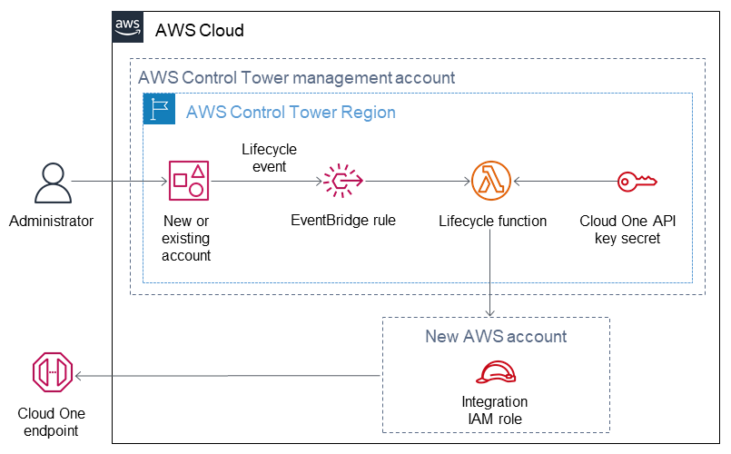

:xrefstyle: short

Deploying this Quick Start with default parameters builds the following {partner-product-short-name} in the AWS Control Tower environment on the AWS Cloud.

// Replace this example diagram with your own. Follow our wiki guidelines: https://w.amazon.com/bin/view/AWS_Quick_Starts/Process_for_PSAs/#HPrepareyourarchitecturediagram. Upload your source PowerPoint file to the GitHub {deployment name}/docs/images/ directory in this repo. 

[#architecture1]
.Quick Start architecture for {partner-product-short-name} on AWS

* An administrator enrolls a new or existing AWS account in AWS Control Tower, generating a lifecycle event.
* The lifecycle event uses an Amazon Eventbridge rule to invoke a Lambda function.
* The Lambda function creates an Identity Access Management (IAM) cross-account role in the newly created AWS account.
* The Lambda function queries AWS Secrets Manager for the API key secrets that are used to authenticate with the {partner-product-short-name} endpoint.
* The Lambda function registers the new AWS account with the {partner-product-short-name} endpoint.

// Original
//* Admin enrolls new or existing AWS accounts into AWS Control Tower, which generates Lifecycle event with new account details.
//* The Lifecycle event triggers the Lifecycle Lambda function via the EventBridge rule to set up the new CloudOne integrations.
//* Lifecycle Lambda function assumes the role into newly created AWS account and creates a cross-account IAM role and registers the new AWS Account with CloudOne Conformity endpoint, calling external APIs.
//* The API keys used to authenticate with the CloudOne endpoint are stored in the Secrets Manager in the Management account.